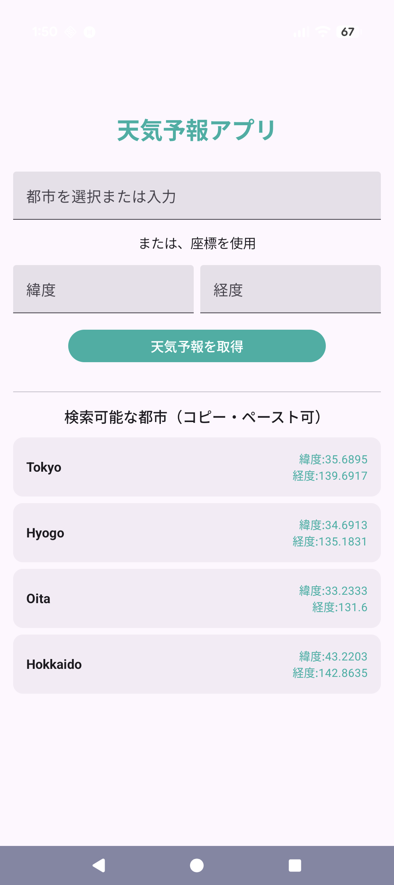
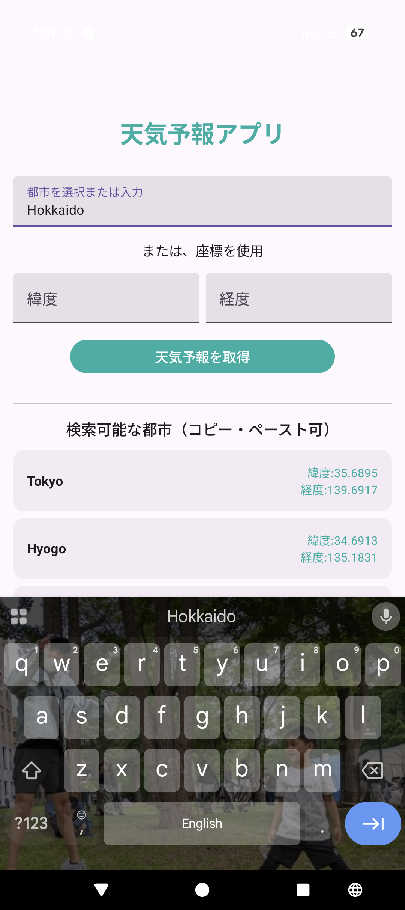
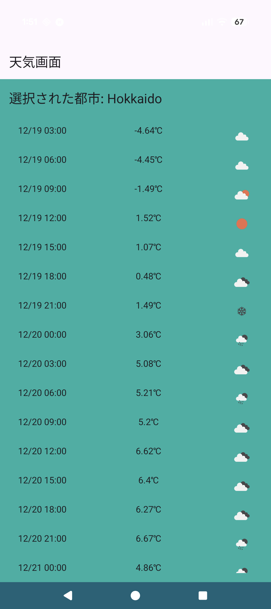
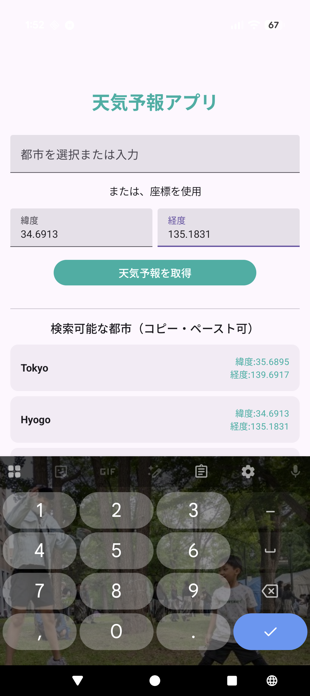
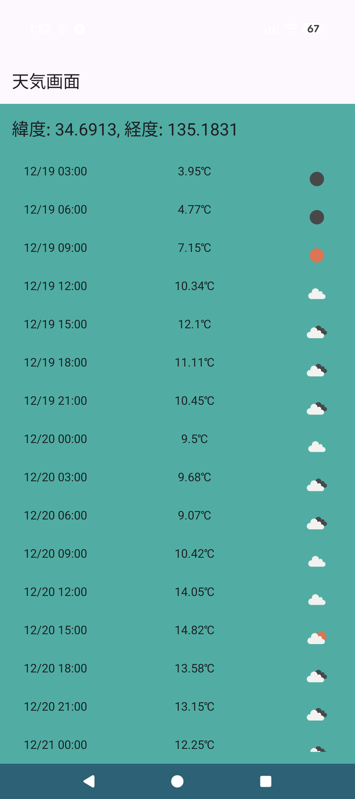

# WeatherForecastApp

## セットアップ手順
このプロジェクトを実行するには、OpenWeatherMap の API キーが必要です。
1.  [OpenWeatherMap](https://openweathermap.org/api) で無料の API キーを取得します。
2.  プロジェクトのルートディレクトリにある `local.properties` ファイルを開きます。
3.  以下の行を追加してください（`""` で囲ってください）:
    OPEN_WEATHER_API_KEY="APIキーをこちらに入れ替えてください。"
4.  Android Studio でプロジェクトを同期 (Sync Project with Gradle Files) し、実行します。
*※ セキュリティのため、API キーは Git に含まれていません。`local.properties.example` を参考にしてください。*

## 技術概要 (Tech Overview in Japanese)
WeatherForecastApp は、Android 向けに Kotlin と Jetpack Compose を用いて開発した 5 日間の天気予報アプリです。  
ユーザーは以下の機能を利用できます:
- 都市入力 （東京、兵庫、大分、北海道）
- OpenWeatherMap API を用いたの天気と 5 日間の予報表示
- ネットワークエラー時のリトライ機能
- 同日キャッシュポリシーによるオフライン表示

* このプロジェクトは、Android アーキテクチャ、API 連携、キャッシュ機能、Git ワークフローを示すための技術課題として作成しました。

## Tech Stack / 技術スタック
- **Language / 言語:** Kotlin
- **UI:** Jetpack Compose, Navigation Compose
- **Architecture / アーキテクチャ:** MVVM + Repository
- **DI:** Hilt
- **Networking / ネットワーク:** Retrofit, OkHttp, Moshi
- **Persistence / 永続化:** Room (SQLite)
- **Async / 非同期処理:** Coroutines + Flow
- **Images / 画像表示:** Coil (天気アイコン)

---

## バージョン管理
バージョン管理は Gradle の defaultConfig により行っています。
defaultConfig {
versionCode = 1
versionName = "1.0.0"
}
* 大規模プロジェクトでは、version.properties ファイルや CI/CD パイプラインを用いて自動的にバージョンを更新することが可能です。

## アーキテクチャ
- UI 層は ViewModel の状態を監視し、ユーザー操作（予報取得、リトライ）を処理します。 
- Repository は Retrofit（ネットワーク）と Room（キャッシュ）を統合し、同日 JST キャッシュポリシーを適用します。
- テスト可能性と保守性を考慮し、データソース（Remote/Local）の隠蔽を行う Repository パターンを採用しています。

## 機能
- 都市リスト（東京、兵庫、大分、北海道）からの選択、または緯度・経度の直接入力による予報取得。
- 天気表示: 3時間ごとの予報（アイコン、気温、日本標準時時刻）。
- エラーハンドリング: ネットワーク未接続時のエラー表示とリトライ機能。 
- オフライン対応: Room データベースを使用した同日キャッシュポリシー。

## 制限事項
- 予報の粒度は 3 時間単位（OpenWeatherMap API の仕様）
- キャッシュは 1 日単位で失効、長期保存はなし
- UI スタイリングは最小限（機能重視）

## スクリーンショット

  
  
  
  
  

## 動作デモ (App Demo)

  <video src="screenshots/offlineCacheImplemented.mp4.mp4" width="300" controls>
    Your browser does not support the video tag.
  </video>

## License / ライセンス
Copyright (c) 2024 Patrician Andres.
This project is for technical evaluation purposes.
本プロジェクトは技術評価目的で作成されたものです。

## Developer / 開発者
- **Name:** Patrician Andres
